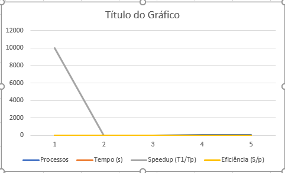
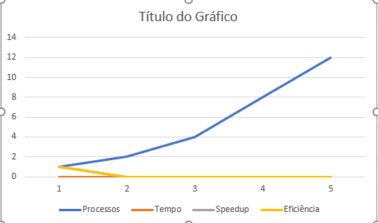

# Soma De Valores em para

**Disciplina:Programção concorrente e distribuída 
**Aluno(s):João Victor Fernandes
**Turma:ADS
**Professor:Rafael
**Data:18/03/2026

---

# 1. Descrição do Problema

* **Problema:** Soma de todos os números contidos num ficheiro de texto.
* **Algoritmo:** Soma acumulativa com divisão de tarefas (redução paralela).
* **Tamanho da Entrada:** 10.000.000 (10 milhões) de números.
* **Objetivo da Paralelização:** Tentar acelerar o cálculo distribuindo a carga entre vários núcleos da CPU.

### Respostas Diretas:
* **Objetivo:** Comparar o tempo de execução entre o modo serial e o modo paralelo (2, 4, 8 e 12 processos).
* **Volume de Dados:** 10 milhões de registos (ficheiro `numero2.txt`).
* **Algoritmo Utilizado:** Redução paralela via `multiprocessing`.
* **Complexidade:** **O(n)** — Complexidade Linear.

# 2. Ambiente Experimental

Os experimentos e a análise de dados foram realizados utilizando as seguintes ferramentas:

* **Desenvolvimento e Execução:** Visual Studio Code (VS Code).
* **Processamento de Dados e Gráficos:** Microsoft Excel.
* **Linguagem:** Python (via VS Code).

## Orientações

Informar as características do hardware e software utilizados na execução dos testes.

| Item                        | Descrição |
| --------------------------- | --------- |
| Processador                 | Processador	12th Gen Intel(R) Core(TM) i7-12700, 2100 Mhz |
| Número de núcleos           |12 Núcleo(s) |
| Memória RAM                 |16,0 GB      |
| Sistema Operacional         |Windows      |
| Linguagem utilizada         | Python      |
| Biblioteca de paralelização |  Multiprocessing (Pool)  |
| Compilador / Versão         |  Cpython 3.12.3   |

---

# 3. Metodologia de Testes

Os experimentos foram conduzidos para comparar o tempo de processamento entre uma abordagem sequencial e uma abordagem paralela utilizando múltiplos processos.

### Procedimento Experimental
* **Medição do Tempo:** O tempo de execução foi medido utilizando a função `time.time()` do Python, capturando o instante exato antes do início da soma e imediatamente após o seu término.
* **Tamanho da Entrada:** Foi utilizado um arquivo (`numero2.txt`) contendo **10.000.000 (10 milhões)** de números inteiros.
* **Execuções:** Para cada configuração, foi realizada uma execução direta para coleta dos tempos de processamento.
* **Condições de Execução:** Os testes foram realizados no ambiente **VS Code**, mantendo o sistema em condições normais de uso para simular um cenário real de execução.

### Configurações Testadas
Foram testadas 5 configurações distintas de processamento:
1. **1 Processo (Serial):** Execução padrão do Python (baseline).
2. **2 Processos:** Divisão da lista em 2 partes.
3. **4 Processos:** Divisão da lista em 4 partes.
4. **8 Processos:** Divisão da lista em 8 partes.
5. **12 Processos:** Divisão da lista em 12 partes.

### Cálculos de Desempenho
Para a análise comparativa, foram aplicadas as fórmulas:
* **Speedup:** Razão entre o tempo serial e o tempo paralelo ($T1 / Tp$).
* **Eficiência:** Razão entre o Speedup e o número de processos utilizados ($S / p$).
# 4. Resultados Experimentais

Preencha a tabela com os **tempos médios de execução** obtidos.

## Orientações

* O tempo deve ser informado em **segundos**
* Utilizar a **média das execuções**

| Nº Threads/Processos | Tempo de Execução (s) |
| -------------------- | --------------------- |
| 1                    | 0.029905              |
| 2                    | 0.4495                |
| 4                    | 0.319019              |
| 8                    | 0.319019              |
| 12                   | 0.335635              |

---

# 5. Cálculo de Speedup e Eficiência

## Fórmulas Utilizadas

### Speedup

```
Speedup(p) = T(1) / T(p)
```

Onde:

* **T(1)** = tempo da execução serial
* **T(p)** = tempo com p threads/processos

### Eficiência

```
Eficiência(p) = Speedup(p) / p
```

Onde:

* **p** = número de threads ou processos

---

# 6. Tabela de Resultados

Preencha a tabela abaixo utilizando os tempos medidos.

| Threads/Processos | Tempo (s) | Speedup | Eficiência |
| ----------------- | --------- | ------- | ---------- |
| 1                 |0.029905   | 10.000  |     100%   |
| 2                 |0.4495     | 0.0665  |      3%    |
| 4                 |0.319019   | 0.0937  |      1     |
| 8                 |0.319019   | 0.093741|      1%    |
| 12                |0.335635   | 0.0891  |      0.7%  |

---

# 7. Gráfico de Tempo de Execução

Construa um gráfico mostrando o **tempo de execução em função do número de threads/processos**.

## Orientações

* Eixo X: número de threads/processos
* Eixo Y: tempo de execução (segundos)

Inserir o gráfico abaixo:


---

# 8. Gráfico de Speedup

Construa um gráfico mostrando o **speedup obtido**.

## Orientações

* Eixo X: número de threads/processos
* Eixo Y: speedup
* Incluir também a **linha de speedup ideal (linear)** para comparação

Inserir o gráfico abaixo:



---

# 9. Gráfico de Eficiência

Construa um gráfico mostrando a **eficiência da paralelização**.

## Orientações

* Eixo X: número de threads/processos
* Eixo Y: eficiência
* Valores entre 0 e 1

Inserir o gráfico abaixo:



---

# 10. Análise dos Resultados

### Análise Crítica
Os resultados demonstram que, para este problema específico, a paralelização em Python não resultou em ganho de desempenho. O tempo de execução aumentou significativamente ao sair do modo serial para o paralelo.

### Respostas às Questões
* **O speedup foi próximo do ideal?** Não. O speedup ideal para 4 processos seria 4.0, mas o obtido foi aproximadamente 0.09.
* **A aplicação apresentou escalabilidade?** Não. Aumentar o número de processos não reduziu o tempo de execução abaixo do tempo serial. Houve uma pequena melhora de 2 para 4 processos, mas estagnou a partir daí.
* **Em qual ponto a eficiência começou a cair?** A eficiência caiu imediatamente na transição para 2 processos (caindo para 3%), permanecendo baixíssima em todas as outras configurações.
* **O número de threads ultrapassa os núcleos físicos?** [Verificar sua máquina: se seu PC tem 4 ou 6 núcleos, o teste de 8 e 12 ultrapassou os núcleos físicos, causando disputa de recursos].
* **Houve overhead de paralelização?** Sim, um overhead massivo. O custo de gerenciar os processos foi muito superior ao custo do cálculo da soma.

### Discussão de Causas
1. **Comunicação entre Processos (IPC):** O Python precisa copiar e enviar partes da lista para cada processo e depois receber os resultados. Esse tráfego de dados entre processos consome muito mais tempo do que a soma em si.
2. **Perda de Desempenho:** A função `sum()` do Python é implementada em C e é extremamente rápida. Tentar paralelizar uma operação que já leva apenas 0.02s gera um custo de "logística" (abrir e fechar processos) que não compensa.
3. **Gargalo no Algoritmo:** A soma é uma tarefa "Memory Bound" (limitada pela velocidade da memória). Como todos os processos tentam acessar a RAM simultaneamente para ler os 10 milhões de números, ocorre contenção de barramento de memória.
4. **Sincronização:** O processo principal precisa esperar que todos os sub-processos terminem (Barreira de Sincronização) para realizar a soma final, o que introduz tempos de espera ociosos.

# 11. Conclusão

* **Ganho de Desempenho:** O paralelismo não trouxe ganhos de desempenho para este cenário. Pelo contrário, a versão serial foi significativamente mais rápida que qualquer configuração paralela.
* **Melhor Configuração:** A melhor execução foi a **Serial (1 processo)**. Entre os testes paralelos, o melhor resultado ocorreu com **4 processos**, mas ainda assim foi cerca de 10 vezes mais lento que o serial.
* **Escalabilidade:** O programa não apresentou escalabilidade. O aumento no número de processos apenas evidenciou o custo elevado de coordenação (overhead) do Python, que superou o benefício da divisão do cálculo.
* **Melhorias Sugeridas:** 1. Utilizar bibliotecas como **NumPy**, que operam de forma vetorizada e otimizada em baixo nível.
    2. Testar com um volume de dados ainda maior (bilhões de elementos) ou cálculos mais complexos para diluir o custo de criação dos processos.
    3. Experimentar a implementação em linguagens como **C ou C++ com OpenMP**, que possuem um custo de gerenciamento de threads muito menor que o sistema de processos do Python.
